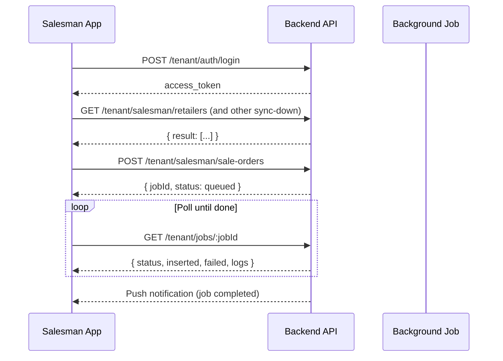

# Salesman App API Reference

REST API documentation for the mobile salesman application. All routes are served from the NestJS backend with no global path prefix (default port `3000`).

**Source locations**

| Area | Path |
|------|------|
| Sync down | `src/tenant/controller/salesman-app/sync-down.controller.ts` |
| Sync up | `src/tenant/controller/salesman-app/sync-up.controller.ts` |
| Retailer visits | `src/tenant/controller/salesman-app/retailer-visit.controller.ts` |
| DTOs | `src/tenant/dto/salesman-app/` |

---

## Table of contents

1. [Authentication](#authentication)
2. [Common conventions](#common-conventions)
3. [Sync down (GET)](#sync-down-get)
4. [Sync up (POST)](#sync-up-post)
5. [Retailer visits](#retailer-visits)
6. [Background jobs](#background-jobs)
7. [Notifications](#notifications)
8. [Profile](#profile)
9. [Employee attendance](#employee-attendance)
10. [Enums reference](#enums-reference)

---

## Authentication

### Login

```
POST /tenant/auth/login
```

No auth required.

**Request body**

| Field | Type | Required | Description |
|-------|------|----------|-------------|
| `email` | string | yes | User email |
| `password` | string | yes | User password |
| `tenantCode` | string | no | Required on mobile when the request host has no tenant subdomain |
| `deviceId` | string | no | Device identifier for push/session tracking |
| `fcmToken` | string | no | Firebase Cloud Messaging token |

**Response**

```json
{
  "access_token": "<JWT>"
}
```

### Other auth endpoints

| Method | Path | Auth | Description |
|--------|------|------|-------------|
| `POST` | `/tenant/auth/setup-password` | No | First-time password setup for invited users |
| `POST` | `/tenant/auth/forgot-password` | No | Request password reset OTP |
| `POST` | `/tenant/auth/verify-reset-otp` | No | Verify reset OTP |
| `POST` | `/tenant/auth/reset-password` | No | Reset password with verified token |
| `GET` | `/tenant/auth/check-account` | JWT | Check account status |
| `POST` | `/tenant/auth/pusher` | JWT | Authorize Pusher private channel for realtime notifications |

### Using the token

Send the JWT on every authenticated request:

```
Authorization: Bearer <access_token>
```

JWT payload includes: `userId`, `tenantId`, `role`, `tenantStatus`, `tenantCode`. The token `type` must be `tenant` and the tenant must be `PROVISIONED`.

---

## Common conventions

### Guard stack

All salesman endpoints use:

1. `TenantJwtAuthGuard` — validates Bearer token
2. `TenantJwtGuard` — requires valid tenant claims
3. `TenantConnectionGuard` — opens tenant database connection
4. `TenantPermissionGuard` — checks route-level permissions (see each endpoint)

`SUPER_ADMIN` role bypasses permission checks.

### Response wrapper

Sync-down and list endpoints return data in a `result` array:

```json
{ "result": [ /* ... */ ] }
```

Paginated lists also include `meta`:

```json
{
  "result": [ /* ... */ ],
  "meta": { "total": 42, "page": 1, "limit": 10 }
}
```

### Validation

Global `ValidationPipe` is enabled with `whitelist`, `forbidNonWhitelisted`, and `transform`. Unknown body fields return `400 Bad Request`.

### Async sync pattern

Sync-up and bulk visit/check-in endpoints queue a background job and return immediately:

```json
{
  "message": "Retailer sync started",
  "jobId": "<uuid>",
  "status": "queued",
  "totalRows": 5
}
```

Poll `GET /tenant/jobs/:jobId` until `status` is `completed` or `failed`. A push notification is sent when the job finishes.

### Permissions

| Permission | Used by |
|------------|---------|
| `SALESMAN_SYNC_DOWN` | All sync-down GET endpoints |
| `SALESMAN_SYNC_UP` | Retailer, sale order, and sale voucher sync-up |
| `CREATE_RETAILER_VISIT` | Visit create and retailer check-in |
| `LIST_RETAILER_VISIT` | Visit history list |
| `VIEW_RETAILER_VISIT` | Single visit detail |

---

## Sync down (GET)

**Base path:** `/tenant/salesman`  
**Permission:** `SALESMAN_SYNC_DOWN`

Download master data and reference records to the mobile device.

### Stock products

```
GET /tenant/salesman/stock-products?distributorId=<uuid>
```

| Query | Type | Required |
|-------|------|----------|
| `distributorId` | UUID | yes |

Returns stock balances for the distributor with joined `distributor`, `product` (category, brand, pricing), `productFlavour`, `flavour`, `uom`, and computed `pricing`.

---

### Schemes

```
GET /tenant/salesman/schemes
```

Returns active, non-deleted schemes with slabs, retailers, products, categories, and channels.

---

### Routes

```
GET /tenant/salesman/routes?distributorId=<uuid>
```

| Query | Type | Required |
|-------|------|----------|
| `distributorId` | UUID | yes |

Returns routes with `area`, `area.region`, and `distributor`.

---

### Retailers

```
GET /tenant/salesman/retailers
```

Returns all retailers with category, channel, route, geo hierarchy, and created/approved user relations.

---

### PJPs (Permanent Journey Plans)

```
GET /tenant/salesman/pjps
```

Returns **active** PJPs for the **logged-in salesman** (`salesmanId = userId`), each with nested `routes` (PJPRoute including route details).

---

### Paid sale vouchers

```
GET /tenant/salesman/paid-sale-vouchers
```

Returns sale vouchers with status `PAID` or `PARTIALLY_PAID` (tenant-wide, not filtered by salesman).

---

### Approved sale invoices

```
GET /tenant/salesman/approved-sale-invoices
```

Returns sale invoices for the **logged-in salesman** with full item relations (product, flavour, pricing, scheme, etc.).

---

### Retailer categories

```
GET /tenant/salesman/retailer-categories
```

Lookup list of retailer categories.

---

### Retailer channels

```
GET /tenant/salesman/retailer-channels
```

Lookup list of retailer channels.

---

## Sync up (POST)

**Base path:** `/tenant/salesman`  
**Permission:** `SALESMAN_SYNC_UP`

Upload field data from the mobile device. All endpoints are async — see [Background jobs](#background-jobs).

### Bulk create retailers

```
POST /tenant/salesman/retailers
Content-Type: multipart/form-data
```

**Max items:** 50 shops per request  
**Job type:** `SALESMAN_RETAILER_SYNC`

**Body field `shops`** — JSON array (can be sent as a string in form-data):

| Field | Type | Required | Notes |
|-------|------|----------|-------|
| `shopName` | string | yes | |
| `ownerName` | string | yes | |
| `image` | string | no | Image URL when no file is uploaded |
| `phone` | string | no | |
| `CNIC` | string | no | |
| `address` | string | yes | |
| `latitude` | string | yes | |
| `longitude` | string | yes | |
| `class` | enum | yes | `A`, `B`, or `C` |
| `status` | enum | no | `ACTIVE`, `INACTIVE`, `PENDING` (default `PENDING`) |
| `routeId` | UUID | yes | |
| `retailerCategoryId` | UUID | yes | |
| `retailerChannelId` | UUID | yes | |

**Image uploads** (optional, one per shop by index):

| Field name pattern | Maps to |
|--------------------|---------|
| `images[0]`, `images[1]`, … | Shop at that index |
| `image_0`, `image_1`, … | Shop at that index |
| `image` or `images` | Shop index `0` (single shop only) |

Allowed formats: PNG, JPEG, WebP. Max size: 5 MB per file.

**Example form-data**

```
shops: [{"shopName":"Ali Store","ownerName":"Ali",...}]
images[0]: <file>
```

---

### Bulk create sale orders

```
POST /tenant/salesman/sale-orders
Content-Type: application/json
```

**Max items:** 50 orders per request  
**Job type:** `SALESMAN_SALE_ORDER_SYNC`

**Body**

```json
{
  "orders": [
    {
      "distributorId": "<uuid>",
      "salesmanId": "<uuid>",
      "retailerId": "<uuid>",
      "routeId": "<uuid>",
      "orderStatus": "PENDING",
      "orderTotal": 1000,
      "taxPercentage": 0,
      "taxAmount": 0,
      "discountPercentage": 0,
      "discountAmount": 0,
      "totalAmount": 1000,
      "schemeId": "<uuid>",
      "schemeSlabId": "<uuid>",
      "notes": "optional",
      "orderDate": "2026-07-07",
      "executedDate": "2026-07-07",
      "deliveredDate": "2026-07-07",
      "items": [
        {
          "productId": "<uuid>",
          "productFlavourId": 1,
          "productPricingId": "<uuid>",
          "schemeId": "<uuid>",
          "schemeSlabId": "<uuid>",
          "quantity": 10,
          "discountPercentage": 0,
          "discountAmount": 0,
          "totalAmount": 500
        }
      ]
    }
  ]
}
```

| Order field | Required |
|-------------|----------|
| `distributorId`, `salesmanId`, `retailerId`, `routeId` | yes |
| `orderTotal`, `totalAmount`, `orderDate` | yes |
| `items` (min 1) | yes |
| `orderStatus`, tax/discount fields, `schemeId`, `schemeSlabId`, `notes`, dates | no |

| Item field | Required |
|------------|----------|
| `productId`, `productFlavourId`, `productPricingId`, `quantity`, `totalAmount` | yes |
| `schemeId`, `schemeSlabId`, discount fields | no |

---

### Bulk create sale vouchers

```
POST /tenant/salesman/sale-vouchers
Content-Type: multipart/form-data
```

**Max items:** 50 vouchers per request  
**Job type:** `SALESMAN_SALE_VOUCHER_SYNC`

**Body field `vouchers`** — JSON array:

| Field | Type | Required | Notes |
|-------|------|----------|-------|
| `retailerId` | UUID | yes | |
| `paymentMethod` | enum | yes | `CASH`, `CHEQUE`, `TRANSFER`, `ONLINE`, `OTHER` |
| `chequeNumber` | string | no | Required when method is `CHEQUE` |
| `chequeDate` | ISO date | no | |
| `bankName` | string | no | |
| `paymentDate` | ISO date | yes | |
| `paymentAmount` | number | yes | Min `0.01` |
| `remarks` | string | no | |
| `status` | enum | no | `PENDING` (draft) or `PAID` (posts ledger immediately) |

**Payment proof uploads** (optional, one per voucher by index):

| Field name pattern | Maps to |
|--------------------|---------|
| `paymentProofs[0]`, `paymentProofs[1]`, … | Voucher at that index |
| `paymentProof_0`, `paymentProof_1`, … | Voucher at that index |
| `paymentProof` or `paymentProofs` | Voucher index `0` |

Allowed formats: PNG, JPEG. Max size: 5 MB per file.

---

## Retailer visits

**Base path:** `/tenant/salesman/retailer-visits`

### Bulk create visits

```
POST /tenant/salesman/retailer-visits/create
Content-Type: multipart/form-data
```

**Permission:** `CREATE_RETAILER_VISIT`  
**Max items:** 50 visits per request  
**Job type:** `SALESMAN_RETAILER_VISIT_SYNC`

**Body field `visits`** — JSON array:

| Field | Type | Required |
|-------|------|----------|
| `retailerId` | UUID | yes |
| `visitStatus` | enum | yes |
| `notes` | string | no (max 1000 chars) |

**Image uploads** (optional):

| Field name pattern | Description |
|--------------------|-------------|
| `shopImages[N]`, `shelfImages[N]` | Images for visit at index `N` |
| `shopImages_N`, `shelfImages_N` | Same, underscore variant |
| `shopImages`, `shelfImages` | Visit index `0` when only one visit |

Up to 10 shop images and 10 shelf images per visit. PNG, JPEG, or WebP. Max 5 MB each.

---

### Bulk retailer check-in

```
POST /tenant/salesman/retailer-visits/check-in
Content-Type: application/json
```

**Permission:** `CREATE_RETAILER_VISIT`  
**Max items:** 50 check-ins per request  
**Job type:** `SALESMAN_RETAILER_CHECK_IN_SYNC`

Validates geo-fence against the retailer's `latitude`, `longitude`, and `maxRadius`. Only one check-in per retailer per day.

**Body**

```json
{
  "checkIns": [
    {
      "retailerId": "<uuid>",
      "checkInLatitude": 31.5204,
      "checkInLongitude": 74.3587
    }
  ]
}
```

Coordinates accept up to 8 decimal places.

---

### List visit history

```
GET /tenant/salesman/retailer-visits
```

**Permission:** `LIST_RETAILER_VISIT`  
Scoped to the logged-in user's visits.

| Query | Type | Default | Description |
|-------|------|---------|-------------|
| `page` | int | `1` | Page number (min 1) |
| `limit` | int | `10` | Page size (min 1, max 100) |
| `retailerId` | UUID | — | Filter by retailer |
| `visitStatus` | enum | — | Filter by status |
| `dateFrom` | string | — | ISO date, start of range |
| `dateTo` | string | — | ISO date, end of range |
| `search` | string | — | ILIKE match on shop name |

**Response fields per visit:** `id`, `visitStatus`, `notes`, `shopImages`, `shelfImages`, `createdAt`, `retailer` (`id`, `shopName`).

---

### View single visit

```
GET /tenant/salesman/retailer-visits/:id
```

**Permission:** `VIEW_RETAILER_VISIT`

Returns the full `RetailerVisit` with relations `retailer`, `route`, and `user`. Returns `403` if the visit belongs to another user.

---

## Background jobs

```
GET /tenant/jobs
GET /tenant/jobs/:jobId
```

Auth required (JWT + tenant guards). Returns jobs for the current user only. Jobs expire after 24 hours.

**Job object**

```json
{
  "id": "<uuid>",
  "tenantCode": "acme",
  "jobType": "SALESMAN_RETAILER_SYNC",
  "fileName": "retailers-sync",
  "status": "completed",
  "createdBy": "<userId>",
  "createdAt": "2026-07-07T10:00:00.000Z",
  "startedAt": "2026-07-07T10:00:01.000Z",
  "completedAt": "2026-07-07T10:00:05.000Z",
  "totalRows": 5,
  "inserted": 4,
  "failed": 1,
  "logs": [
    {
      "row": 1,
      "name": "Ali Store",
      "status": "success",
      "createdAt": "2026-07-07T10:00:02.000Z"
    },
    {
      "row": 2,
      "name": "Bad Shop",
      "status": "error",
      "error": "Route not found",
      "createdAt": "2026-07-07T10:00:03.000Z"
    }
  ]
}
```

**Status values:** `queued`, `processing`, `completed`, `failed`

**Salesman job types**

| Job type | Triggered by |
|----------|--------------|
| `SALESMAN_RETAILER_SYNC` | `POST /tenant/salesman/retailers` |
| `SALESMAN_SALE_ORDER_SYNC` | `POST /tenant/salesman/sale-orders` |
| `SALESMAN_SALE_VOUCHER_SYNC` | `POST /tenant/salesman/sale-vouchers` |
| `SALESMAN_RETAILER_VISIT_SYNC` | `POST /tenant/salesman/retailer-visits/create` |
| `SALESMAN_RETAILER_CHECK_IN_SYNC` | `POST /tenant/salesman/retailer-visits/check-in` |

---

## Notifications

```
GET  /tenant/notifications
PUT  /tenant/notifications/:id/read
```

Auth required. Sync job completions create notifications with these types:

| Notification type | Source |
|-------------------|--------|
| `salesman_retailer_sync` | Retailer sync |
| `salesman_sale_order_sync` | Sale order sync |
| `salesman_sale_voucher_sync` | Sale voucher sync |
| `salesman_retailer_visit_sync` | Visit sync |
| `salesman_retailer_check_in_sync` | Check-in sync |

Notification payload includes a `job` object with full sync results when the job completes.

---

## Profile

```
GET   /tenant/profile
PATCH /tenant/profile/password
```

Auth required.

| Endpoint | Description |
|----------|-------------|
| `GET /tenant/profile` | Returns user profile (password stripped) with geo names |
| `PATCH /tenant/profile/password` | Change password (`currentPassword`, `newPassword`) |

---

## Employee attendance

Separate from retailer geo check-in. Base path: `/tenant/attendance`.

| Method | Path | Permission | Description |
|--------|------|------------|-------------|
| `POST` | `/tenant/attendance/check-in` | — | Employee day check-in |
| `POST` | `/tenant/attendance/check-out` | — | Employee day check-out |
| `GET` | `/tenant/attendance/overview` | `LIST_ATTENDANCE` | Attendance overview |
| `GET` | `/tenant/attendance` | `LIST_ATTENDANCE` | Paginated attendance list |
| `GET` | `/tenant/attendance/:id` | `VIEW_ATTENDANCE` | Single attendance record |
| `GET` | `/tenant/attendance/:id/tracking-logs` | `VIEW_ATTENDANCE` | GPS tracking logs |
| `POST` | `/tenant/attendance/:id/tracking-logs` | `CHECK_IN_ATTENDANCE` | Append tracking log |

### Salesman attendance history

Base path: `/tenant/salesman/attendance`.

| Method | Path | Permission | Description |
|--------|------|------------|-------------|
| `GET` | `/tenant/salesman/attendance/history` | — | Monthly attendance summary and daily records for the logged-in user (`month`, `year` query params) |

---

## Enums reference

### Retailer class (`class`)

`A` | `B` | `C`

### Retailer status (`status`)

`ACTIVE` | `INACTIVE` | `PENDING`

### Visit status (`visitStatus`)

| Value | Meaning |
|-------|---------|
| `ORDER_BOOKED` | Order placed during visit |
| `NO_SALE` | Visit completed, no sale |
| `SHOP_CLOSED` | Shop was closed |
| `OWNER_ABSENT` | Owner not present |
| `STOCK_FULL` | Retailer has sufficient stock |
| `RETURN_BOOKED` | Return booked |

### Order status (`orderStatus`)

`PENDING` | `APPROVED` | `REJECTED` | `PROCESSING` | `CANCELLED` | `DELIVERED`

### Payment method (`paymentMethod`)

`CASH` | `CHEQUE` | `TRANSFER` | `ONLINE` | `OTHER`

### Sale voucher status (`status`)

`PENDING` | `PAID` (only these two accepted on sync-up)

---

## Quick endpoint index

| # | Method | Path | Permission |
|---|--------|------|------------|
| 1 | `GET` | `/tenant/salesman/stock-products` | `SALESMAN_SYNC_DOWN` |
| 2 | `GET` | `/tenant/salesman/schemes` | `SALESMAN_SYNC_DOWN` |
| 3 | `GET` | `/tenant/salesman/routes` | `SALESMAN_SYNC_DOWN` |
| 4 | `GET` | `/tenant/salesman/retailers` | `SALESMAN_SYNC_DOWN` |
| 5 | `GET` | `/tenant/salesman/pjps` | `SALESMAN_SYNC_DOWN` |
| 6 | `GET` | `/tenant/salesman/paid-sale-vouchers` | `SALESMAN_SYNC_DOWN` |
| 7 | `GET` | `/tenant/salesman/approved-sale-invoices` | `SALESMAN_SYNC_DOWN` |
| 8 | `GET` | `/tenant/salesman/retailer-categories` | `SALESMAN_SYNC_DOWN` |
| 9 | `GET` | `/tenant/salesman/retailer-channels` | `SALESMAN_SYNC_DOWN` |
| 10 | `POST` | `/tenant/salesman/retailers` | `SALESMAN_SYNC_UP` |
| 11 | `POST` | `/tenant/salesman/sale-orders` | `SALESMAN_SYNC_UP` |
| 12 | `POST` | `/tenant/salesman/sale-vouchers` | `SALESMAN_SYNC_UP` |
| 13 | `POST` | `/tenant/salesman/retailer-visits/create` | `CREATE_RETAILER_VISIT` |
| 14 | `POST` | `/tenant/salesman/retailer-visits/check-in` | `CREATE_RETAILER_VISIT` |
| 15 | `GET` | `/tenant/salesman/retailer-visits` | `LIST_RETAILER_VISIT` |
| 16 | `GET` | `/tenant/salesman/retailer-visits/:id` | `VIEW_RETAILER_VISIT` |
| 17 | `GET` | `/tenant/salesman/attendance/history` | — |

---

## Typical mobile sync flow


